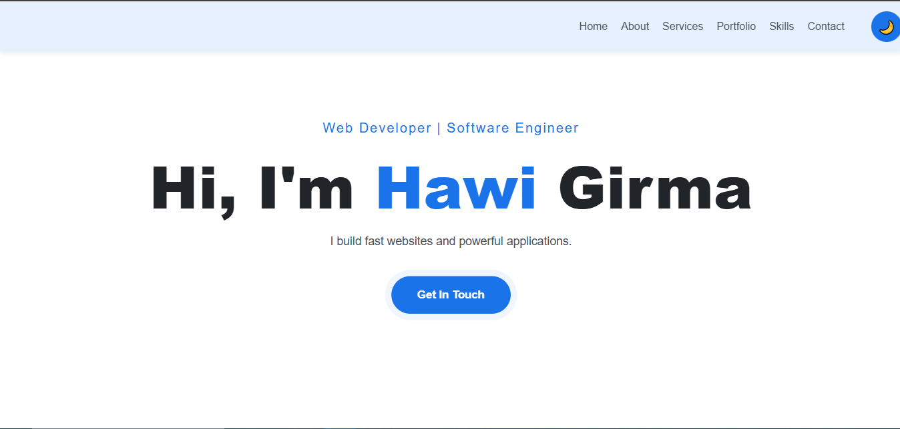
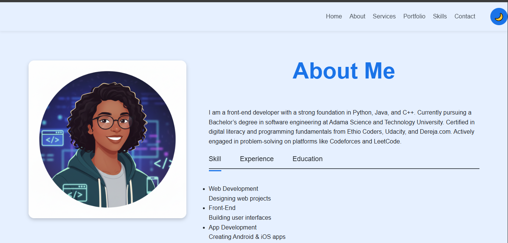

# 🚀 Developer Portfolio

This repository hosts the source code for my personal developer portfolio, designed as a professional single-page application (SPA).

## 💡 Main Idea
The portfolio serves as a digital resume, effectively showcasing my skills, experience, and key projects (Chatbot Websites, Restaurant Order System, and ASTU Performance Evaluation System) to potential employers and collaborators.

## 🛠 Built With (Technologies)
The portfolio is primarily built using foundational web technologies:
* **HTML5** and **CSS3** (with a responsive design approach)
* Vanilla **JavaScript** (for DOM manipulation, theme toggle, and mobile menu functionality)

## ✨ Future Improvements
Potential future enhancements for this portfolio include:
* Integrating a backend service (e.g., Node.js/Express) to handle contact form submissions instead of relying on external mail links.
* Implementing animations or parallax scrolling to enhance the visual appeal and user engagement.
* Adding case study pages for each project to provide detailed documentation on problem-solving and technical challenges.
## 📸 Preview

This section shows the visual content of the main sections of the website in both Dark and Light themes.

### 🌙 Dark Mode Views

#### 🏠 Home Section (Dark)

#### 👤 About Section (Dark)

### ☀️ Light Mode Views

#### 🏠 Home Section (Light)

#### 👤 About Section (Light)
